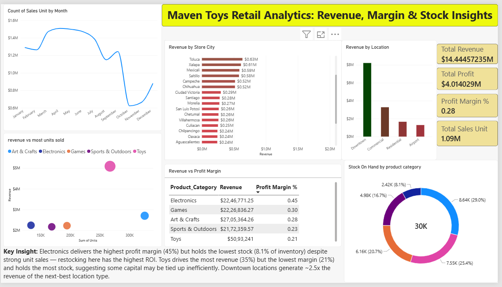

# Maven Toys Retail Analytics: Revenue, Margin & Stock Insights

## Business Problem
Which stores and product categories should Maven Toys prioritize for 
restocking and marketing investment next quarter, and are there any 
stores or products at risk of lost sales due to inventory issues?

## Data Source
## Data Source
Maven Toys dataset from [Maven Analytics](https://mavenanalytics.io/data-playground/mexico-toy-sales)
includes sales, products, stores, inventory, and calendar tables.

## Tools Used
Power BI (Power Query, Data Modeling, DAX)

## Process
- Cleaned and modeled data into a star schema (sales as fact table, 
  linked to products, stores, and calendar dimensions)
- Built DAX measures for revenue, profit margin, and inventory turnover
- Designed a single-page interactive dashboard for 
  date, store, and category

## Key Findings
- Electronics delivers the highest profit margin (45%) but holds the 
  lowest stock share (8.1%) despite strong unit sales — indicating 
  restocking here has the highest ROI
- Toys drives the most revenue (35% of total) but has the lowest 
  margin (21%) and the highest stock share — suggesting capital may 
  be tied up inefficiently
- Downtown store locations generate ~2.5x the revenue of the next-best 
  location type
- Revenue is concentrated in three cities (Ciudad de Mexico, 
  Guadalajara, Monterrey), accounting for ~30% of total revenue

## Recommendations
1. Increase Electronics stock allocation given its high margin and 
   thin inventory buffer
2. Review Toys inventory levels to free up potentially inefficiently 
   allocated capital
3. Prioritize Downtown-type locations for new store openings or 
   marketing spend

## Dashboard Preview

*Note: Interactive .pbix file is available in this repo — open in 
Power BI Desktop to explore filters and charts.*
